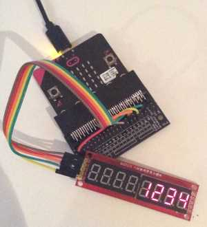
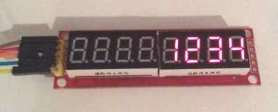
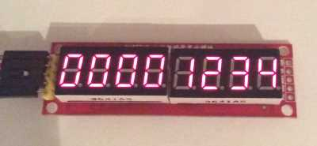
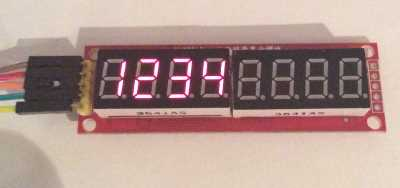

{:.ui .image .small .floated .right}

This module will display 8 numerical digits on its display. Each digit is a 7-segment display comprised of 8 LEDs (7 for the number, and one for a decimal place).

It's possible to drive each of these component LEDs either directly, or through a shift register. However, these modules use the `MAX7219` driver chip to simplify the process.

The microbit tells the `MAX7219` chip which number to display over SPI. The chip then displays the digit.

Like the HT1633 8x8 module on this site, the LED displays are connected to a backpack containing the `MAX7219` chip and wiring.

{:.ui .dividing .header}
### Components

These 7-segment MAX7219 displays are available on eBay, Amazon and other sellers. Searching for `MAX7219 7-segment display` reveals the components. They're around £2 each.

Additionally, you will need a microbit breakout board to access the SPI pins of the microbit.

{:.ui .dividing .header}
### Electronics

#### Purpose of Each Pin

There are five wires to connect to the display module. Each of the pins do the following:

{:.ui .very .basic .table}
| Pin Name | Purpose |
|--- |--- |
| VCC | for power |
| GND | for ground |
| CS / Chip Select | Goes low when data is being transmitted to the device. Goes high at the end of transmission. `.write_digital()` is used for this. |
| DIN | Data transmitted over this wire. |
| CLK | Tells the microbit when to transmit data. |

#### Hookup Table

Connect the module to the microbit and its edge connector as below. Be aware the pin labels can change dependning on the manufacturer:

{:.ui .very .basic .table}
| My Module Label | Possible Label Names | microbit Pin | Micropython Doc Names for pin |
|--- |--- |--- |--- |
| VCC |  | 3v | |
| GND |  | GND | |
| DIN | SOMI, SDI, DI, DIN, SI, MRST. | `pin14` | MISO (master in, slave out) |
| CS | nCS, CSN, nSS, STE, SYNC | `pin0` | n/a, but frequently called _chip select_ |
| CLK | SCLK | `pin13` | Serial Clock |

* *Your module might also have a `DOUT` pin. Ignore it!*

To connect to these pins, you will need the microbit edge connector. Here's my module wired up to my microbit:

{:.ui .image}

{:.ui .dividing .header}
### Code

#### Download the Module

Download the `Maxrix7seg` [module for the microbit from Github.](https://github.com/microbit-playground/matrix7seg/blob/master/matrix7seg.py). This contains the code used to communicate with the 7-segment display.

#### Import Module

The module is imported in the header of your Python script:


from microbit import spi

# from matrix7seg.py import Matrix7seg class
from matrix7seg import Matrix7seg

# Initialise an instance of the Matrix7seg class
# and call it 'seg_display'.
# It's connected to default SPI pins. pin0 is chip select
# pin1 or pin2 etc could be used instead.
seg_display = matrix7seg(spi, pin0)


#### Add the `matrix7seg` Module

Once your script is complete and has been flashed, the `matrix7seg` module can be copied to the microbit:

1. Flash your script.
2. Click 'Files' within in the mu editor.
3. From the `/mu_code/` directory, copy drag the `matrix7seg.py` file across to the microbit.
4. Press reset on your microbit to reload the Python program with the `matrix7seg` module.

#### Using the Module

It's now possible to use the display module within the microbit:


# Number must be 8 or fewer digits
seg_display.write_number(1234)

# Update display with '1234'
seg_display.show()


Each time `.write_number()` is used, `.show()` must be used to update the display.

#### Code Examples

##### `.write_number()`


# display a number
seg_display.write_number(1234)


##### `.write_number(n, zeroPad=True)`


# empty 7-segments filled with 0
seg_display.write_number(1234, zeroPad=True)


##### `.write_number(n, leftJustify=True)


# justify numbers to left
seg_display.write_number(1234, leftJustify=True)


#### Example Programs

##### Increment Numbers to 100


# sequentially write numbers to 100
for i in range(100)
    seg_display.write_number(i)
    seg_display.show()


##### Show the Temperature

# read and display the temperature every second
while True:
    seg_display.write_number(temperature())
    seg_display.show()
    sleep(1000)


##### G-Force Game


# record total acceleration experienced by the microbit
# if it's the highest value recorded by the microbit,
# display the reading on the screen.
# importing as little as possible to save memory

from microbit import spi, accelerometer, sleep, pin0
from math import sqrt
from matrix7seg import Matrix7seg

def total_acceleration():
    """
    return total acceleration in milli-g across all 3 axes.
    """
    x = accelerometer.get_x()
    y = accelerometer.get_y()
    z = accelerometer.get_z()

    # root of sum of squares
    total = sqrt(x**2 + y**2 + z**2)
    return total

highest_reading = 0

segment = Matrix7seg(spi, pin0)

while True:
    reading = total_acceleration()
    if reading > highest_reading:
        highest_reading = reading
    segment.write_number(highest_reading)
    segment.show()

