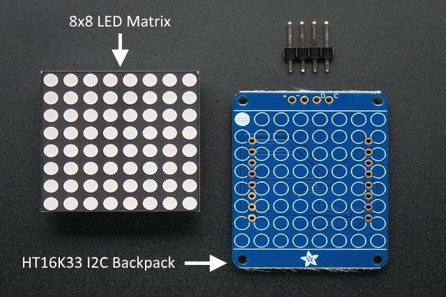

An 8x8 LED Matrix is a component where 64 LEDs are arranged in a grid.

In this page the LED matrix plugs into a 'backpack' which drives the display.

The backpack uses the HT16K33 IC which interprets I2C instructions given to it by the microbit.

{:.ui .image}

The LED matrix plugs into the backpack or is soldered depending on the version.

It is possible to drive just the matrix without the backpack using a shift register but this can be messy.

Instead we send I2C commands to the backpack which in turn lights the 8x8 matrix.

{:.ui .dividing .header}
### Components

There are two components needed: an LED matrix and HT16K33-based backpack. Usually these are sold together as a module. A search on eBay or Amazon reveals many results to `HK16K33 backpack` which range from £3 -- £10.

Alternatively, you could shop at [Adafruit](https://www.adafruit.com/product/1052) who kindly provided many of the photos used in this page!

In some instances you will need to solder the LED matrix to the backpack. There's a fantastic [tutorial on Adafruit](https://learn.adafruit.com/adafruit-led-backpack/1-2-8x8-matrix) on how to do it.

{:.ui .dividing .header}
### Electronics

A microbit edge connector is required to access the I2C pins on the microbit. These are `pin19` and `pin20` of the microbit.

{:.ui .basic .small .table}
| Backpack Pin | Microbit Pin |
|--------|----------|
| `GND` | `GND` |
| `VCC+` | `3V` |
| `DAT` or `SDA` | `PIN 20` |
| `CLK` or `SCA`  | `PIN 19` |

The I2C naming conventions are different than usual. `SCL = CLK` & `SDA = DAT`.

#### I2C Addresses

The I2C bus is accessed through `pin19` and `pin20`. There are already components on the bus. These are:

{:.ui .basic .small .table}
| Device | I2C Address |
|--------|----------|
| Accelerometer | `0x1D` |
| Magnetometer | `0x0E` |

Each device on the bus must occupy a different address. The HT16K33 module has its own I2C address. The address is usually found on the datasheet or product page of the component. On the Adafruit backpack it's possible to [change the I2C address](https://learn.adafruit.com/adafruit-led-backpack/changing-i2c-address) if required.

Alternatively, the microbit's I2C bus can be scanned for devices. There is a [guide to scanning the I2C bus on this website](/howto/scan-i2c-bus).

{:.ui .dividing .header}
### Code

[Radomir Dopieralski](https://bitbucket.org/thesheep/) has written a Python module to control HT16K33-based backpacks. [Download the HT16k33 driver](https://bitbucket.org/thesheep/microbit-ht16k33/raw/a5b7961f0b57ba226ab98edc2c5f8d95d8954d00/ht16k33.py) and save it to your computer.

Upload the saved module to the microbit in mu. See [here for tutorial on how to add modules](/howto/add-python-module-microbit-micropython).


from microbit import i2c, sleep

from ht16k33 import Matrix8x8

# address of HT16K33 is 0x70
display = Matrix8x8(i2c, address=0x70)

# Run through each pixel individually and turn it on.
for x in range(8):
	for y in range(8):
		display.pixel(x, y, 1)
		display.show()
		sleep(50)

# Clear the display
display.fill(0x00)
display.show()
sleep(1000)

# Fill display
display.fill(0xff)
display.show()
sleep(1000)

# Cycle through the brightness levels
for x in range(15):
    display.brightness(x)
    sleep(50)



  

    Alternative: MAX7219 LED Driver
  

  
The MAX7219 is an alternative driver that uses SPI. Multiple LED displays can be linked together. I've not managed to slim a module down yet for the microbit. 

