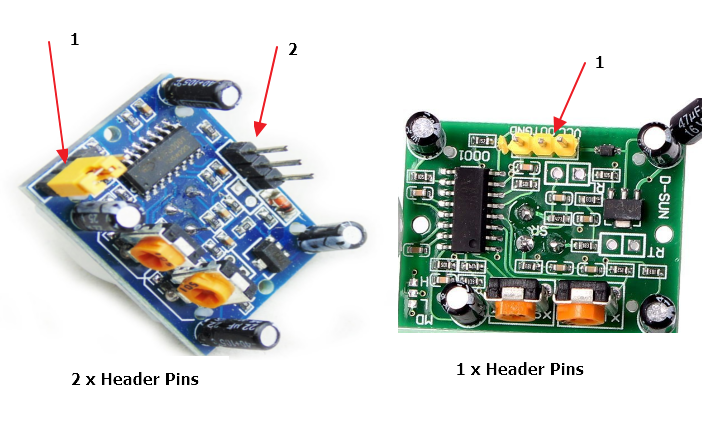

The PIR sensor module will detect movement and report it to the microbit as a digital signal. There are many PIR sensor modules on the market but the most common one is based on the DYP-ME003 PIR sensor module by Open Impulse. This module runs at 5v so requires _some_ hacking to work with the microbit.

{:.ui .dividing .header}
### Components

#### Buying the Sensor

A search on eBay or Amazon for HC-SR501 or DYP-ME003 will return the sensor you need. These are usually around £2.

The sensor differs slightly between manufactures: some boards have two sets of header pins whilst others have only one set. If the sensor has two sets of header pins it requires _no_ soldering to convert to 3.3v. If it has only one set of header pins it must be soldered.

...so try to get a PIR sensor with two sets of header pins!

{:.ui .image}

Confirmed PIR sensor modules with two sets of header pins:

* Demarkt HC-SR501
* Adafruit PIR (motion) sensor
* Any many others

#### Using a Sensor with 2 x Header Pins

Attach the microbit's `3v pin` to the header pin on the PIR sensor labelled `H`.

Attaching it to the H pin bypasses the voltage regulator on the sensor and enables it to run on 3.3v. The jumper attached to these pins can be discarded.

There is more about this process and its discovery on [tech gurka](http://techgurka.blogspot.co.uk/2013/05/cheap-pyroelectric-infrared-pir-motion.html)

#### Setting Sensitivity &amp; Delay

There are two potentiometers labelled TIME (or T) and SENSITIVITY (or S) on the sensor module. Adjusting SENSITIVITY  changes the detection range from 3m to up to 7m. As the range increases, the more sensitive to movement it becomes.

TIME represents the duration of the output signal. If it detects movement, the TIME parameter controls how long the sensor will output HIGH. This can be changed from 5s through to 300s.

{:.ui .dividing .header}
### Electronics

Hook up the sensor to the microbit as shown:

{:.ui .celled .striped .table}
| PIR Sensor Pin | Microbit Pin |
|----------------|--------------|
|  `OUT`        |   `PIN0`  |
|  `GND`        | `GND` |
| `H`           | `3v`  |

{:.ui .dividing .header}
### Code

  <a class="item active" data-tab="first">Python</a>

Scroll __movement__ on the microbit's display `if pin0.read_digital = True:`


from microbit import *

while True:

    if pin0.read_digital:
        display.scroll("Movement")
    sleep(1000)


### Experiment
* Trigger an alarm!
