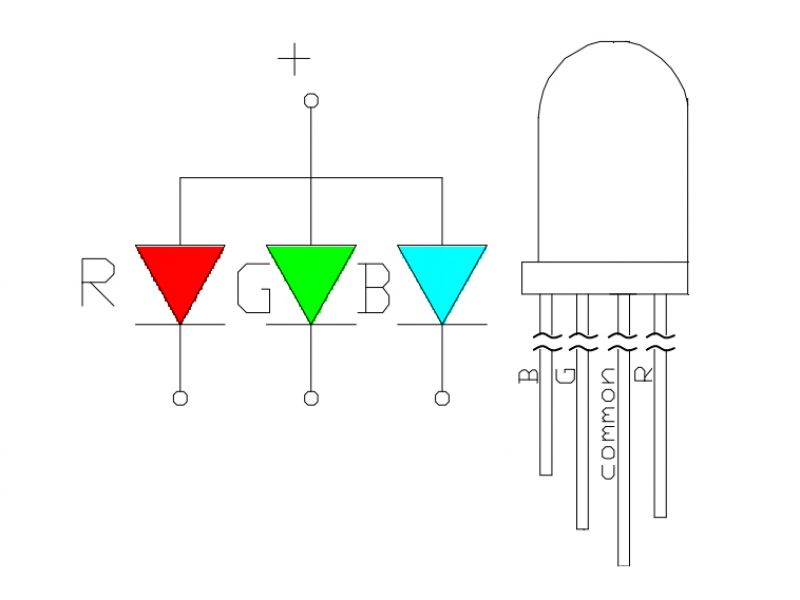
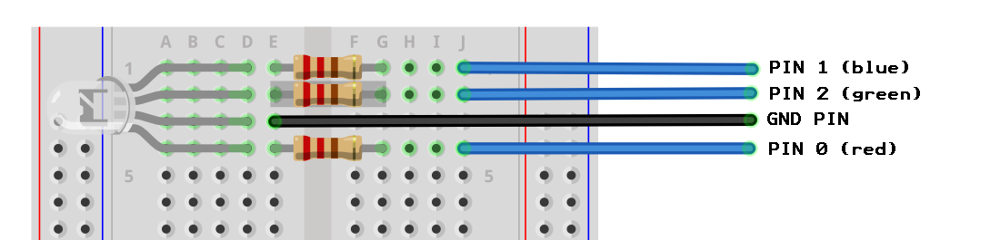

An RGB LED is essentially a red, green and blue LED combined into one package. 

{:.ui .image}

An RGB LED has four legs: an anode to drive each of the three component colours and a common cathode. The longest pin is the common cathode (**-**) and is used by all other LEDs in the package.

Each of the colours---red, green and blue---can be made my supplying current to the shorter pins. Usually the order of the pins is the same as the diagram above; but occassionally they can change, and sometimes it's even a common anode.

{:.ui .centered .image}

Any coloured light can be made by varying how bright the red, blue and green LEDs are lit. This can be done with `pin0.write_analog(n)` where *n* is a value between 0 (off) and 1023 (on full). 

{:.ui .dividing .header}
### Electronics

220&#8486; resistors are placed before the each of the anode pins. 220&#8486; is a safe choice and will cover all RGB LEDs. You can consult the datasheet of the LED if you have it; you may not even need a resistor but it's better safe than sorry!

{:.ui .image}



{:.ui .dividing .header}
### Code

  <a class="item active" data-tab="first">Python</a>

Code to show a yellow light for two seconds then show a red light slowly turning magenta


from microbit import *

# assign colour names to each of the pins
red = pin0
blue = pin1
green = pin2

while True:
	
    # Make Yellow
    red.write_digital(1)
    green.write_digital(1)
    sleep(2000)			 # Show yellow for 2 seconds

    # Turn off Yellow
    red.write_digital(0)
    green.write_digital(0)

    # turn on red
    # slowly increment the intensity of blue to make magenta
    red.write_digital(1)
    for i in range(0,1023):
        blue.write_analog(i)
        sleep(10)

    # turn off pins before repeating
    red.write_digital(0)
    blue.write_digital(0)


{:.ui .dividing .header}
### Notes

* `pin0.analog_write(512)` is half as bright as `pin0.analog_write(1023)`.



### Experiment
* Use `random.randrange(start, stop, step)` to generate a random colour every few seconds
* Use three potentiometers to mix the colours