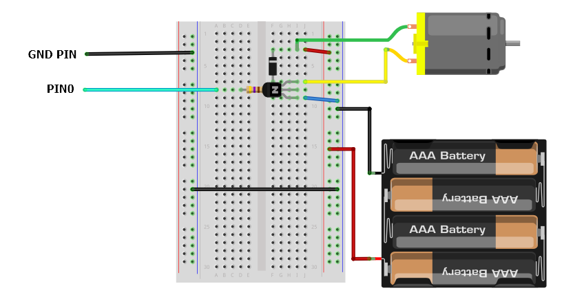

```
too complex
Use a motor board.
```

A simple 6V DC motor takes takes electrical energy into mechanical energy. It has hundreds of uses in microbit projects.

{:.ui .dividing .header}
### Electronics

#### Transistor

The motor requires a higher voltage and current than the microbit is capable of supplying by itself. The solution is to drive the motor with a transistor.

The micro:bit's `pin0` is connected to the base of the transistor. The emitter is connected to ground. The motor sits between the positive of the battery and the collector of the transistor. The grounds of the battery and the microbit are connected together (a common ground).

{:.ui .image}

When pin0 sends a signal to the base of the transistor, the transistor opens and completes the circuit between ground and the motor &amp; battery.

#### Diodes &amp; Back EMF

Electric motors are 'noisy' and can create electromagnetic interference. When the motor is stopped it can create a reverse voltage which can damage the circuit (or worse, the microbit!). A diode is added across the motor which stops this reverse voltage.

#### Speed Control

The speed of the motor can be controlled with python's `write_analog()` (or a similar block in PXT) and PWM. This stands for `pulse width modulation` and is where the signal is rapidly being turned on and off.

Whereas `write_digital(1)` or `write_analog(1023)` outputs a constant voltage of 3.3v, `write_analog(511)` the power is on exactly 50% of the time; or is at 50% duty. The total energy of the signal is 1.65v, or half of 3.3v. The transisor is able to receive the signal and turn on the motor for 50% of the time also.

There is a [more detailed explaination of PWM](http://microbit-micropython.readthedocs.io/en/latest/pin.html) on the micropython documentation.

#### Final Circuit

{:.ui .image}


* 1x 1N 4001 Diode
* Small 6v DC Motor
* 6v (4 x AA) Battery Box
* 470Ω 1/4W Resistor
* MPSA14 Darlington Transistor


{:.ui .dividing .header}
### Code

<div class="ui top attached tabular menu">
  <a class="item active" data-tab="first">Python</a>
</div>
<div class="ui bottom attached tab segment active" data-tab="first">

Power the motor at 100%, 50% &amp; 25%.


from microbit import *


while True:

    pin0.write_analog(1023)     # full power
    sleep(2000)
    pin0.write_digital(0)      # turn it off
    sleep(2000)


    pin0.write_analog(511)     # 50% duty
    sleep(2000)
    pin0.write_digital(0)      # turn it off
    sleep(2000)

    pin0.write_analog(255)     # 25% duty
    sleep(2000)
    pin0.write_digital(0)      # turn it off
    sleep(2000)




</div>

### Notes
* This is only drive the motor one way. To go forwards and reverse you'll need an h bridge.
* Using motors soon gets complex and unwieldy. Consider a motor driver board!

### Further Reading
* [PWM explanation in the python microbit docs](http://microbit-micropython.readthedocs.io/en/latest/pin.html).
* [Mike Cook's Motor Introduction](http://www.thebox.myzen.co.uk/Workshop/Motors_1.html).
