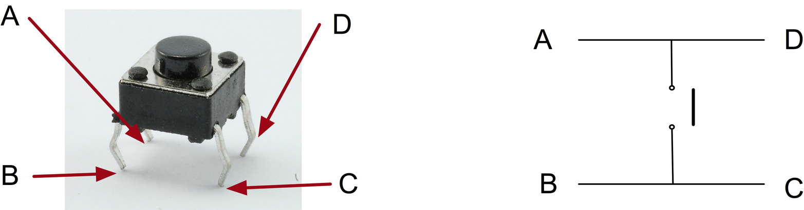
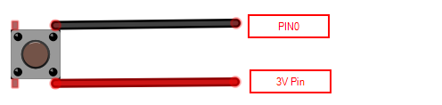

A small push button can be used to provide an external input into your circuits.

{:.ui .image}

This is a small, SMD-mount tactile switch identical to the ones on your microbit.  These switches are normally open (or *NO*) and so must be pushed to close the circuit. It said to be momentary as it must be held to close.

{:.ui .dividing .header}
### Electronics

One of the button's pins is connected to 3V. The corresponding pin to `pin0` of the microbit. When the button is pressed, `pin0` reads `True` or `1`. 

{:.ui .image .centered}

{:.ui .dividing .header}
### Code

  <a class="item active" data-tab="first">Python</a>

Display a tick if button attached to `PIN0` is pressed


from microbit import *

while True:
    # if pin1.read_digital() == 1
    if pin1.read_digital():
        display.show(Image.YES)
    else:
        display.show(Image.NO)
    sleep(10)



### Experiment
* Add multiple buttons
* Count button presses. It'll be wrong; why?

  

    Pull-down Resistor?
  

  
The microbit has internal pull-up and pull-down resistors. When a digital input is read by the microbit, the pull-down resistors are turned on so there is no need for an external one. 

  
This behaviour can be modified in PXT but not Python. 

