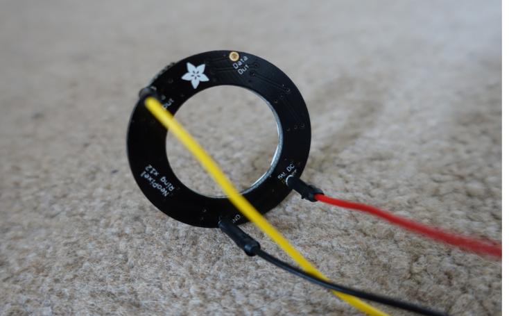
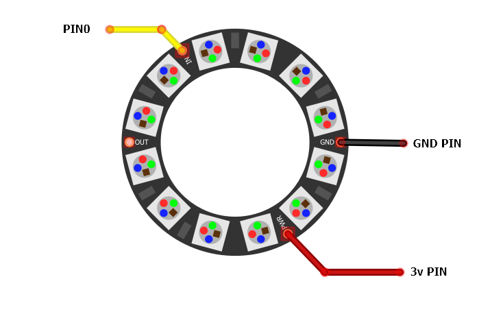

{::options parse_block_html="true" /}
<video autoplay="" loop="" class="ui image medium right floated">
    <source src="images/neopixels.mp4" type="video/mp4">
    Your browser does not support the video tag.
    </video>

Neopixels are RGB LEDs sold by an electronics company called Adafruit. The modules come in different shapes and can contain any number of RGB LEDs. Each LED can be controlled (or addressed) individually. The microbit can drive around 8 LEDs; to control modules with more LEDs you'll need to use an external 5v power source.

You can get generic, Neopixel-style modules by searching for 'ws2812 LED' on eBay or Amazon.

{:.ui .dividing .clearing .header}
### Components

Most neopixel modules require the user to solder on their own connections. This is simple; here's one of my modules:

{:.ui .image}

* Solder wires to PWR, GND and IN.
* In this example the wires are colour-coded: black (for GND), red (for PWR) or yellow (for IN)

{:.ui .dividing .header}
### Electronics

{:.ui .image}

Connect the pins to the microbit. In this example, the `in` pin on the neopixel is connected to `pin 0`.

{:.ui .dividing .header}
### Code

Neopixels can now be used in PXT. I'll update this page.

  <a class="item active" data-tab="first">Python</a>

The `neopixel` library must be imported:


import neopixel


Initialise the neopixel module. Here the variable `neopixels` is assigned to `neopixel.NeoPixel(pin0, 12)`.


# neopixel connected to pin0 and there are 12 LEDs
neopixels = neopixel.NeoPixel(pin0, 12)


Each neopixel is now in the list `neopixels` and can be individually addressed. Colour is controlled by a tuple of RGB values:


neopixels[0] = (0,255,0) # First LED to red
neopixels[1] = (255,150,0) # Second LED to white
neopixels[-1] = (255,0,0) # Final LED to yellow

# Neopixels only change when 'show' method is called
neopixels.show ()


#### Simple Traffic Light (as above)

Light three pixels next to each other either red, amber or red.



from microbit import *
import neopixel

neopixels = neopixel.NeoPixel(pin0, 12)

neopixels[0] = (255,150,0) # First LED to Amber
neopixels[1] = (0,255,0) # Second LED to Green
neopixels[-1] = (255,0,0) # Final LED to Red

neopixels.show() # Light the LEDs


#### Sequentially Light Each Pixel

Light one LED in the neopixel red for 200 milliseconds then light the next one.


from microbit import *
import neopixel

neopixels = neopixel.NeoPixel(pin0, 12)

while True:
    # Do this for each pixel in the neopixels list
    for pixel in range(0, len(neopixels)):
        neopixels[pixel] = (255,0,0) # Turn on red
        neopixels.show() # show red
        sleep(200)       
        neopixels[pixel] = (0,0,0) # Turn off red


### Experiment
* Use `random.ranrange(0,255)` to set an LED to a random colour
* Define a function to fade in the LED
