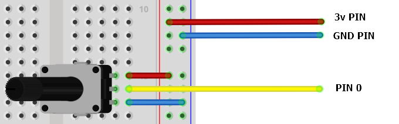
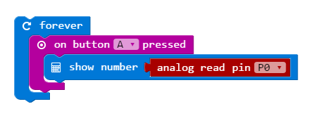
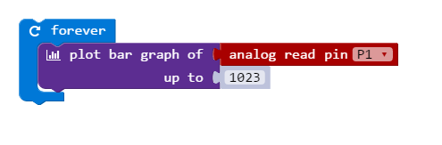

Potentiometers are a type of resistor. The incoming voltage is divided between the middle and the GND pin. How this is divided depends on the rotation of the knob.

We can read the value of the middle pin (or wiper) with `.analog_read()`. The value it returns tells us about the rotation of the shaft.

{:.ui .dividing .header}
### Electronics

The outer pins are connected to 3V and GND. The the middle pin is connected to the microbit.

This is a 10k potentiometer; you can use others without problems.

{:.ui .image .centered}

{:.ui .dividing .header}
### Code

  <a class="item active" data-tab="first">Python</a>
  <a class="item" data-tab="second">MS Blocks</a>

Show the reading of the potentiometer. The reading of pin0.read_analog() will range from 0 - 1023 depending on the rotation of the knob.


from microbit import *

while True:
	## pot_reading variable is the reading from pin0
    pot_reading = pin0.read_analog()

    display.scroll(str(pot_reading))
    sleep(10)



Show the reading of the potentiometer as a percent


from microbit import *

while True:
	# Calculate percent
	# read_analog() outputs 0 (0%) to 1023 (100%)
	# Reading of 1023 is 3.3v
	pot_percent = (pin0.read_analog() / 1023) * 100

	display.scroll(str(pot_percent))
	sleep(10)



Control the brightness of the pixel in the centre of the display (2,2)

from microbit import *

while True:
	# set_pixel brightness if between 0 - 9
	brightness = (pin0.read_analog() / 1023) * 9

	display.set_pixel(2, 2, brightness)
	sleep(10)



When button a is pressed show the reading of pin 0

Rotate the knob to fill the microbit display with lit pixels. Note the potentiometer is connected to PIN1 in this example. There's no good reason for it; it's a mistake.

### Experiment
* Dim an external LED
* Control the pitch of music
* Control the speed of a scroll
