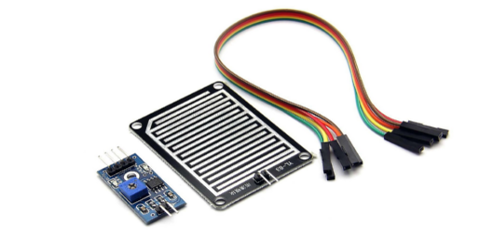

A rain sensor will detect droplets of water when they fall on the sensor board. 

{:.ui .dividing .header}
### Component

The sensor board has two traces on it and the microbit can measure the resistance between the two. In this example, it connects to a module which converts the analog signal from the rain sensor to a digital output.

#### Which Sensor?
A search for 'FC-37' or 'YL-83' or 'Arduino Raindrop Sensor' will yield the sensor that's required.

The sensor usually comes with two modules. One part detects the raindrops, the other takes a signal from the sensor and outputs it as an analog or digital signal. It's possible to use the big raindrop detector module on its own; see the _Soil Moisutre Sensor_ entry on how to do it. 

#### Setting Sensitivity
First we need to provide power to the sensor to set its sensitivity:

* Connect the two modules together
* Connect the `GND` pin on the small module to the microbit's `GND` pin. 
* Connect the module's `VCC` or `+` pin to the microbit's `3v pin`.

An LED will light on the module. 

There is a small potentiometer on the module. This sets the level of sensitivity required for the sensor to output a digital signal to say it has detected water.

Add a few 'rain drops' to the sensor. Rotate the potentiometer until the second the LED lights. At this level, the sensor will return a `1` digital signal.

{:.ui .dividing .header}
### Electronics

#### Warning Notes

Providing constant power to the rain sensor degrades the board. Electrolysis occurs when it's wet.

Power to the board can be controlled if it's connected to one of the microbit's `0`, `1` or `2` pins. Turn on the sensor only when a reading is being taken.

#### Analog or Digital?

In this example we will use a digital output: the sensor will return `HIGH` or `1` if there is rain present. There are four pins on the module; one of them is marked _A_ and the other is marked _D_.

We will take the digital signal so we connect to the 'D' pin.

#### Circuit & Hookup

{:.ui .celled .striped .table}
| Rain Sensor Pin | Microbit Pin |
|----------------|--------------|
|  `VCC`        |   `PIN0`  |
|  `GND`        | `GND` |
| `D` or `Digital`           | `PIN1`  |

{:.ui .dividing .header}
### Code

  <a class="item active" data-tab="first">Python</a>
  <a class="item" data-tab="second">MS Blocks</a>


from microbit import *

while True:
    
    pin0.write_digital(1)  # Turn on the sensor
    sleep(500)  # Wait for the sensor to settle
    
    if pin1.read_digital():
       display.show(Image.SAD) # it's raining
    else:
      display.show(Image.HAPPY) # not raining

    pin0.write_digital(0)      # turn off sensor
    sleep(600000)  # Sleep for 10 minutes


