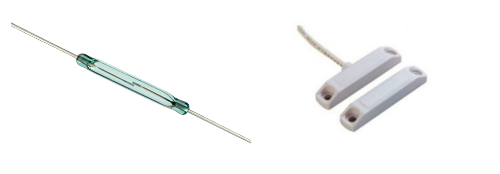

A reed switch opens and closes in the presence of a magnet.

Typically they are usually open and closed when near a magnet.

The circuit and code for the reed switch is essentially the same as the [button also covered in the components base.](button)

{:.ui .dividing .header}
### Component

Reed switches can come in many different forms. Both of those below are reed switches. A search on Amazon on eBay will reveal many more types but they all work the same way.

{:.ui .image .medium .centered}

The reed switch on the right is enclosed in two-part module. The upper module contains the reed switch, the lower part is the magnet to trigger the reed switch. These are usually found in burglar alarm systems.

{:.ui .dividing .header}
### Electronics

The reed switch is connected to the microbit between `pin0` and the `3v` pin. The circuit is the same as [the button example.](button)

{:.ui .dividing .header}
### Code

  <a class="item active" data-tab="first">Python</a>
  <a class="item" data-tab="second">MS Blocks</a>

Scroll 'burglar' on display if reed switch is open (the magnet is not present; eg. the door is open)


from microbit import *

while True:
    if pin0.read_digital():
        # reed switch is closed.
        # magnet present
        display.show(Image.HAPPY)
    else:
        # reed swich open
        # magnet not present
        display.scroll('Buglar')

    sleep(20)



### Notes
* The microbit can be used as a reed switch with the onboard magnetometer. `compass.get_field_strength()` returns the magnetic field in nano teslas.
