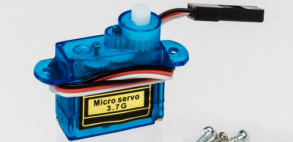
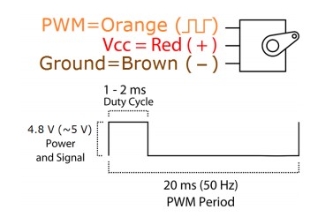
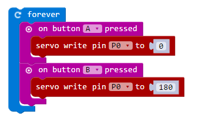

The __Tower Pro SG90__ is a small, 9 gram servo that can run directly from the microbit power supply. This is a 180&deg; servo meaning it can turn from 0&deg; to 180&deg;. It has many applications: open a flap to dispense treats for to a dog, create a robotic walker, or to drive window wipers on a car.

{:.ui .dividing .header}
### Electronics

#### Which Wire is Which?

Most servos have three wires: GND, POWER, and SIGNAL.

Wire colours differ based on manufacturer. Here's the Tower Pro servo; look at the wire colours:

{:.ui .image .centered}

Information about the wire colours can be found in the datasheet. This can be found by Googling _SG90 datasheet_:

{:.ui .image .centered}

We now know how to connect the servo:

{:.ui .very .basic .small .table}
| Servo Wire Colour | Data Sheet Label | Connect to Microbit Pin |
| Red | VCC (+) | `3V` pin |
| Brown | Ground (-) | `GND` pin |
| Orange | PWM (Signal) | `pin0` |

The angle of the servo is set by a PWM pulse to the orange wire. This is connected to `pin0`.

{:.ui .dividing .header}
### Code

Servos are difficult to control in Python on the microbit. I've tried to make it easy below.

  <a class="item active" data-tab="first">Python</a>
  <a class="item" data-tab="second">MS Blocks</a>

A module must be installed to tell Python how to use the servo. 

#### Steps

* Download the [Servo class](https://github.com/microbit-playground/microbit-servo-class/blob/master/) and save it in the `/mu_code` directory in your home folder.
* Upload the code below to your microbit.
* Upload the `servo.py` file to the microbit within mu.

There are [detailed instructions on adding a module to the microbit on this website](/howto/add-python-module-microbit-micropython).

#### Code


from microbit import *

from servo import Servo

while True:
    Servo(pin0).write_angle(0)
    sleep(200)
    Servo(pin0).write_angle(90)
    sleep(200)
    Servo(pin0).write_angle(180)
    sleep(200)



The angle of the servo is controlled by `Servo(pin0).write_angle(30)`. If you want to control a servo attached to pin1 as well, it would be: 


Servo(pin1).write_angle(30)


We can also make this a variable for ease of use:


sv1 = Servo(pin0)
sv2 = Servo(pin1)

sv1.write_angle(180)
sv2.write_angle(0)


[There is additional detail about the `Servo` class on github](https://github.com/microbit-playground/microbit-servo-class)

### Experiment
* Play with the [sweep example](https://github.com/microbit-playground/microbit-servo-class/blob/master/examples/twist-example.py) to rotate the servo through 180&deg;

