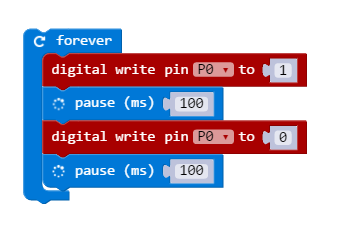

It's possible to use the external pins on the micro:bit to control external LEDs.

{:.ui .dividing .header}
### Electronics

Electric current can only flow _one way_ through a _light emitting diode_ (LED). It must flow through its anode (**+**) and out its cathode (**-**) to light.

The anode has a longer leg and often has a bend in it.

{:.ui .image}

A 220&#8486; resistor is added to reduce the voltage; without it the LED would blow.



{:.ui .dividing .header}
### Code

<a class="item active" data-tab="first">Python</a>
<a class="item" data-tab="second">MS Blocks</a>

#### Flash a Single LED


from microbit import *

while True:
    pin0.write_digital(1)
    sleep(500)
    pin0.write_digital(0)
    sleep(500)


#### Fade an LED


from microbit import *

fade_amount = 5   # How much to change brightness each iteration
speed = 10        # speed brightness changes
brightness = 0

while True:
    brightness = brightness + fade_amount
    if (brightness <= 0) or (brightness >= 1023):
        fade_amount = -fade_amount
    else:
        pin0.write_analog(brightness)
    sleep(speed)


Creates a lot of flickering in Python; not quite sure yet.

#### Flash a Single LED

### Experiment
* Remove the resistor; what happens?
* Reverse the polarity of the LED; what happens?
* Make the LED flash when the button is pushed.
