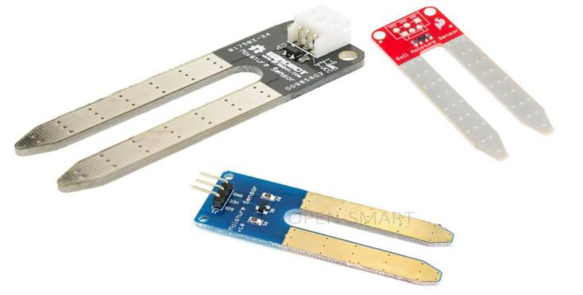

A soil moisture sensor module is designed to measure the amount of water in the soil by reading its resistance. It passes an electric current through the two prongs and measures the resistance of the soil.

{:.ui .dividing .header}
### Components

#### Which Sensor?
{:.ui .image}

A search on eBay or Amazon for `soil moisture sensor arduino` will yield many different types of sensors. The one used in this example should have three components on the prongs itself. There are three variations of the same type above.

#### Which Connectors?

{:.ui .image .floated .right}

The Soil Moisture Sensor has three header pins. These are labelled VCC, Output and GND. To connect wires to the sensor you will need female header pin connectors. _Pictured right_ are examples of hookup wires with female header pin connectors.

#### Notes of Caution

Supplying constant power to the sensor drastically reduces its lifespan. The metal on the prongs slowly degrade dues to electrolysis. It's much better to only power the sensor when you want to take a reading. In the example on this page, the sensor is turned on just before a reading is taken and then turned off.

{:.ui .dividing .header}
### Electronics

Hook up the sensor to your microbit:

{:.ui .celled .striped .table}
| Moisture Sensor Pin | Microbit Pin |
|----------------|--------------|
|  `VCC`        |   `PIN0`  |
|  `GND`        | `GND` |
| `SIG` or `OUT`           | `PIN1`  |

{:.ui .dividing .header}
### Code

  <a class="item active" data-tab="first">Python</a>

### Establish a Threshold

We need to establish what the sensor's reading is when the plant needs to be watered (the soil is dry) and when the plant needs to be watered (the soil is wet).

##### Open REPL
1. Open mu
2. Flash a blank program (this can just read `from microbit import *)
3. Click 'REPL' button

##### Reading for Dry Soil

We need to know what sensor reading should trigger the need to water it. Attach `VCC` to `3V` pin and SIGNAL to `pin0`. Put the sensor in dry soil and type in `pin0.read_analog()` in REPL. The return will look something similar to this:


MicroPython v1.7-9-gbe020eb on 2016-04-18; micro:bit with nRF51822
Type "help()" for more information.
>>> pin0.read_analog()
80


`80` is the reading for dry soil on our sensor.

##### Reading for Moist Soil

We also need to establish a 'good' reading for adequately watered soil. Repeat the above but with soil that has been watered. With my sensor, a well watered plant gave a reading of `211`.

#### Using the Threshold

With the data we obtained we can now say:

* A well watered plant will give a reading of around `211`.
* A dry plant will give a reading of around `80`.

With these reading we can conclude a soil sensor reading of less than 180 requires the soil to be watered. Using these reading we can now write our code.

### Final Code

Show a sad face if the sensor reading is less than 180 (dry).


from microbit import *

# sensor reading at which the soil needs watering
threshold = 180

while True:
    pin0.write_digital(1) # turn on sensor
    sleep(2000) # wait for sensor to settle

    if pin1.read_analog() < threshold: # needs watering
        display.show(Image.SAD, clear=False)
    else:
        display.show(Image.HAPPY, clear=False)

    pin0.write_digital(0) # turn off sensor
    sleep(300000) # sleep for 5 minutes



### Experiment
* Analog sensor reading, especially with a moisture sensor, can be jumpy and erratic.  You can create a function to smooth the reading from the sensor.
* Output a sound to a speaker or a buzzer.
* Pump water the plants.

### Notes of Caution
* These sensors are pretty terrible at reading the moisture content of the soil in a plant pot. The resistance of the soil is modified not just by the moisture content, but by temperature and the humidity outside. They're also pretty quick to degrade. You have been warned!
