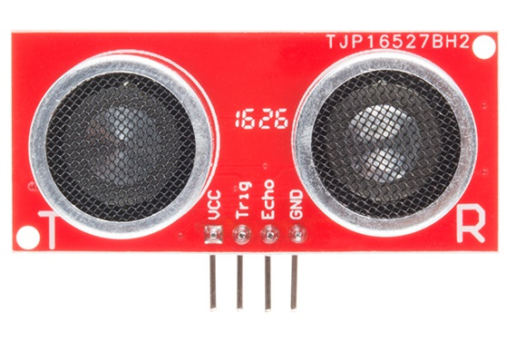
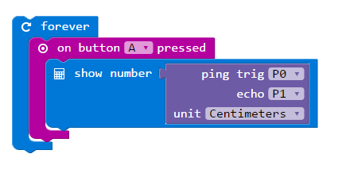

Sonar uses sound to detect objects. It can be used to measure distance to an object.

#### How Sonar Works

{:.ui .image}

The distance from the sensor to the object can be calculated by measuring the time sound takes to return to the sensor after a pulse.

{:.ui .dividing .header}
### Component
A HC-SR04-compatible sensor module has a speaker and microphone; one sends an ultrasonic pulse of sound, the other receives it. By measuring the difference between the pulse and echo, the distance to the object can be calculated.

{:.ui .image}

There are four pins:

* VCC: for 3v voltage
* Trig: triggers a pulse of ultrasound
* Echo: outputs high if the pulse of ultrasound is detected.
* GND: ground

Searching Amazon or eBay for `HC-SR04` will reveal many examples of these sensors. They're around £1 each.

{:.ui .dividing .header}
### Electronics

Hook up the sensor as follows:

{:.ui .celled .striped .table}
| HC-SR04 Sensor | Microbit Pin |
|----------------|--------------|
|  `VCC`         | `3v`         |
|  `GND`         | `GND`        |
|  `Trig`        | `PIN0`       |
|  `Echo`        | `PIN1`       |

{:.ui .dividing .header}
### Code

  <a class="item active" data-tab="first">PXT.io</a>

The ultrasound sensor requires measurements in microseconds and so is only available in PXT.IO.

You will need to add the sonar package to the project.

{:.ui .dividing .header}
### Notes
* For use with Python, use an I2C ultrasound distance sensor. These are usually quite expensive.
